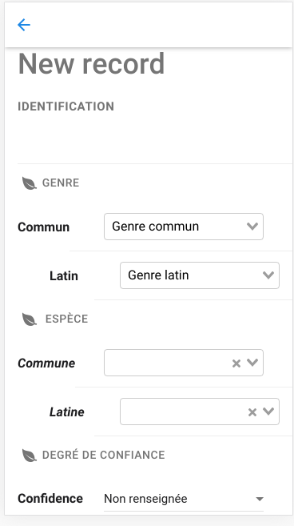

# Front-end structure

### Navigation patterns

Albiziapp follows the pattern of OnsenUI Framework \([https://onsen.io/v2/api/vue/](https://onsen.io/v2/api/vue/)\). 


Pages are either root \(in navbar\), or stacked \(on top of a root page, or a stacked page\)






All stacked page have a back button \(blue arrow\)


### Navigation components

These navigation pattern are based on two top-level components.  

```javascript
src/AppTabBar.vue
src/AppNavigator.vue
```

The former describe the state of the root. The later manages the push/pop operations associated with the stack pattern.

#### The tab bar \(simplified\)

```javascript
    <v-ons-tabbar
      position="auto"
      :tabs="tabs"
    ></v-ons-tabbar>
    
computed: {
    tabs() {
      var tab = 
      [
        {
          label: this.$t('map'),
          icon: "ion-map",
          active: false,
          page: Map,
          theme: red
        },
        {
          label: this.$t('mission'),
          icon: "ion-home",
          page: Home,
          theme: red
        },       
        {
          label: this.$t('records'),
          icon: "ion-edit",
          page: Releve,
          theme: purple,
        },
        {
          label: "Folia",
          icon: "ion-search",
          page: Folia,

          theme: purple
        }
      ]
      return tab
    },


```

The v-ons-tabbar component has a **tabs** property. In vueJS, a property starting with a column is **bound** to the local context.

Here the binding occurs with the variable tabs \(declared tabs\(\)\). 


Try to change labels or icon in tabs\(\) declaration.



